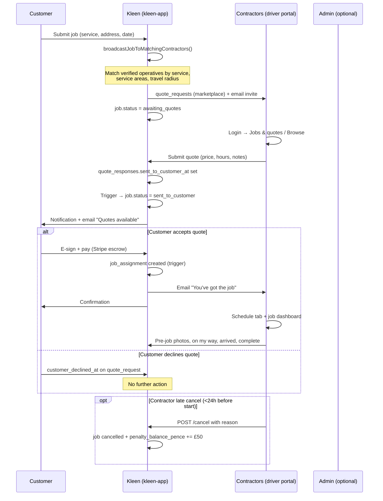

# Job marketplace algorithm

End-to-end flow from customer submit → contractor quotes → acceptance → schedule → completion/cancel.

## Flow diagram

## Steps (what happens automatically)

| Step | Trigger | Result |
|------|---------|--------|
| 1. Job submitted | `POST /api/jobs/submit` | Job + details + estimate quote row |
| 2. Broadcast | Same request, after admin email | `quote_requests` for each matching contractor; `marketplace_broadcast_at` set |
| 3. Contractor quotes | Portal apply or respond to invite | `quote_responses` with markup; DB trigger promotes job to `sent_to_customer` |
| 4. Customer chooses | Dashboard quotes page | Accept → payment → assignment; Decline → nothing |
| 5. Live job | Assignment exists | Schedule + job dashboard (photos, field actions) |
| 6. Late cancel | Contractor cancel API | `cancelled` + penalty on operative account |

## Contractor matching rules

Reuses the same logic as the browse board:

1. Operative is **verified** and **active**
2. Offers the job's **service** (`operative_services`)
3. Job **postcode** matches **service_areas** (if areas configured)
4. Distance from **base_postcode** ≤ **max_travel_radius_miles** (default 25)

## Key files

| Area | Path |
|------|------|
| Broadcast on submit | `kleen-app/src/lib/broadcast-job-to-contractors.ts` |
| Submit hook | `kleen-app/src/app/api/jobs/submit/route.ts` |
| Auto-promote trigger | `kleen-app/supabase/migrations/047_*.sql` |
| Contractor apply | `kleen-contractor/.../jobs/apply/route.ts` |
| Customer accept | `kleen-app/src/lib/stripe-job-accept.ts` |
| Schedule UI | `kleen-contractor/.../ScheduleCalendar.tsx` |
| Cancel + penalty | `kleen-contractor/.../jobs/[jobId]/cancel/route.ts` |

## Deploy checklist

1. Run migration **047** on Supabase production
2. Redeploy **kleen-app** (dashboard) — broadcast + Resend invite emails
3. Redeploy **kleen-contractor** (driver) — schedule, cancel API
4. Ensure `RESEND_API_KEY` and `NEXT_PUBLIC_CONTRACTOR_PORTAL_URL` are set on dashboard

## Admin role

Admin can still manually invite contractors, edit quotes, and override status. Marketplace broadcast runs in parallel — contractors also see open jobs on **Browse** even without an invite row.

## Penalty policy (MVP)

- **Window:** less than 24 hours before scheduled start (`preferred_date` + `preferred_time`)
- **Amount:** £50 (`LATE_CANCEL_PENALTY_PENCE = 5000`)
- **Storage:** `operatives.penalty_balance_pence` — deducted from future payouts (manual/admin reconciliation until payout automation reads this field)

Customer refunds on contractor cancel are handled separately via admin / Stripe (not automated in this MVP).
